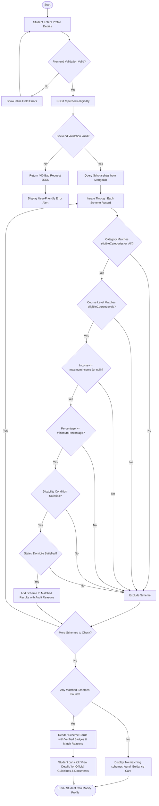

# Eligibility Evaluation Flowchart

```mermaid
flowchart TD
    Start(["Start"]) --> InputDetails["Student Enters Profile Details"]
    InputDetails --> ClientValidation{"Frontend Validation Valid?"}
    
    ClientValidation -- No --> ShowFormErrors["Show Inline Field Errors"]
    ShowFormErrors --> InputDetails

    ClientValidation -- Yes --> SendPost["POST /api/check-eligibility"]
    SendPost --> ServerValidate{"Backend Validation Valid?"}
    
    ServerValidate -- No --> Return400["Return 400 Bad Request JSON"]
    Return400 --> ShowServerError["Display User-Friendly Error Alert"]
    
    ServerValidate -- Yes --> FetchSchemes["Query Scholarships from MongoDB"]
    FetchSchemes --> LoopSchemes["Iterate Through Each Scheme Record"]
    
    LoopSchemes --> CheckCat{"Category Matches eligibleCategories or 'All'?"}
    CheckCat -- No --> NextScheme["Exclude Scheme"]
    
    CheckCat -- Yes --> CheckCourse{"Course Level Matches eligibleCourseLevels?"}
    CheckCourse -- No --> NextScheme
    
    CheckCourse -- Yes --> CheckIncome{"Income <= maximumIncome (or null)?"}
    CheckIncome -- No --> NextScheme
    
    CheckIncome -- Yes --> CheckMarks{"Percentage >= minimumPercentage?"}
    CheckMarks -- No --> NextScheme
    
    CheckMarks -- Yes --> CheckDisability{"Disability Condition Satisfied?"}
    CheckDisability -- No --> NextScheme
    
    CheckDisability -- Yes --> CheckState{"State / Domicile Satisfied?"}
    CheckState -- No --> NextScheme
    
    CheckState -- Yes --> AddEligible["Add Scheme to Matched Results with Audit Reasons"]
    
    NextScheme --> MoreSchemes{"More Schemes to Check?"}
    AddEligible --> MoreSchemes
    
    MoreSchemes -- Yes --> LoopSchemes
    MoreSchemes -- No --> AnyMatched{"Any Matched Schemes Found?"}
    
    AnyMatched -- Yes --> RenderCards["Render Scheme Cards with Verified Badges & Match Reasons"]
    AnyMatched -- No --> RenderNoMatch["Display 'No matching schemes found' Guidance Card"]
    
    RenderCards --> ViewDetails["Student can click 'View Details' for Official Guidelines & Documents"]
    RenderNoMatch --> EndFlow(["End / Student Can Modify Profile"])
    ViewDetails --> EndFlow
```
